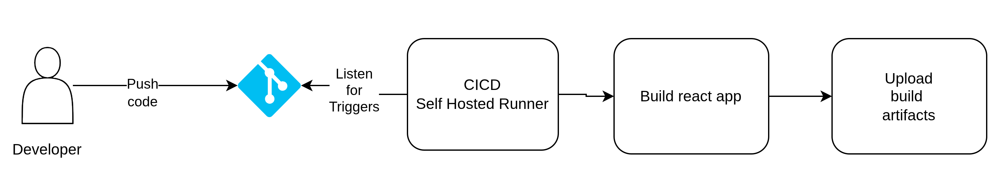
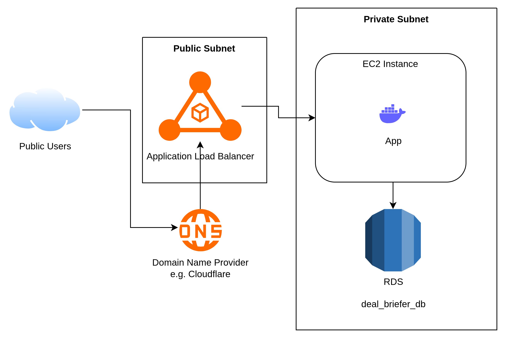
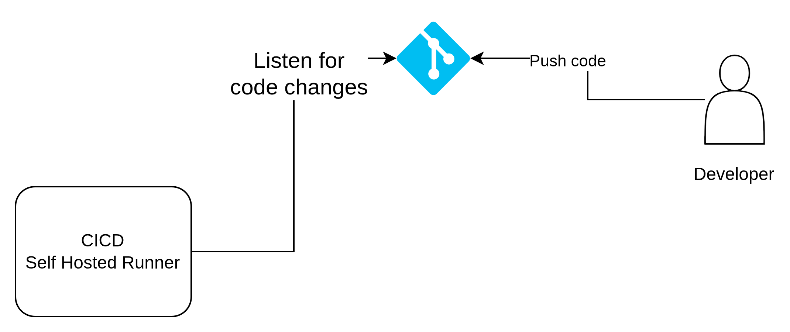
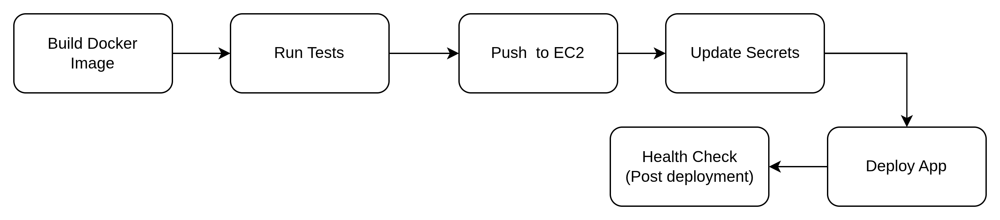

# AWS Deployment

This document provides a guideline for the deployment of this application on production scale on AWS.

Assumptions:

- The client budget for this application won't exceed ~3000 USD/monthly.
- The infrastucture will use VMs - No ECS or K8s given the assumed scaled.
- The total users of this application won't exceed ~1000 users daily with 20 - 50 concurrent users.
- Assumes IaC (Infrastructure as code) technology will be setup for this project such as: Terraform.
- Assuming using self-hosted CI/CD runner for more generic instructions.
- Assuming frontend will be developed on a separate repo - in this project, I have the frontend on the same repo for simplicity.

To be able to scale our application on EC2, application needs to be **stateless** - meaning it can't store any data on machine, therefore, S3 will need to be utilized to store any files.

In case of using any job orchestration for asynchronouse processing, it needs to be scaled independetly rather than attaching it to the same application to ensure atomcity.

---

## Frontend Deployment

Frontend deployment given the assumed scale is preferred to be deployed on S3 static website hosting.



### S3 Bucket settings

* Bucket name: deal-briefer-react-prod
* Region: same as CI/CD (recommended)
* Block public access: ON (initially)

### Enable Static Website Hosting

- Enable Static website hosting
* Index document: index.html
* Error document: index.html (important for React routing)

### Setup bucket policy

```
{
  "Version": "2012-10-17",
  "Statement": [
    {
      "Sid": "PublicRead",
      "Effect": "Allow",
      "Principal": "*",
      "Action": "s3:GetObject",
      "Resource": "arn:aws:s3:::deal-briefer-react-prod/*"
    }
  ]
}
```

### Cloudfront or Cloudflare

Needed for HTTPs supprt, caching support, and security.

### CI/CD Flow

1. Checkout code
2. Install dependencies
3. Build React app
4. Upload to S3
5. Invalidate CloudFront/Cloudflare cache

---

## Infrastructure

### Target Architecture



### IAM Roles, IAM Policies and Networking

#### IAM Roles for terraform

Setup IAM credentials for Terraform with adminstrative permissions on:

- VPC and Networking.
- EC2 management
- RDS management
- Secrets Manager or SSM parameter store.
- AWS SSM (System Manager) - for managing EC2 fleet locally without SSH using AWS CLI.

#### Networking Setup

##### VPC & Networking Setup

**1.1 Create VPC**

- CIDR: 10.0.0.0/16
- DNS hostnames: enabled
- DNS resolution: enabled

**1.2 Subnet Layout**

| Subnet        | CIDR         | AZ   | Purpose |
| ------------- | ------------ | ---- | ------- |
| Public-1      | 10.0.1.0/24  | az-a | ALB     |
| Public-2      | 10.0.2.0/24  | az-b | ALB     |
| Private-App-1 | 10.0.11.0/24 | az-a | EC2     |
| Private-App-2 | 10.0.12.0/24 | az-b | EC2     |
| Private-DB-1  | 10.0.21.0/24 | az-a | RDS     |
| Private-DB-2  | 10.0.22.0/24 | az-b | RDS     |

**1.3 Internet and NAT Setup**

Internet Gateway -> Attach to VPC

NAT Gateway -> Create 1 NAT per AZ (recommended) and Place it in public subnet

##### Security Setup

**2.1 ALB Security Group**

- Inbound: 80 / 443 → 0.0.0.0/0
- Outbound: 80 / app-port → EC2 SG

**2.2 EC2 Security Group (App)**

* Inbound: App port (e.g. 8000) → ALB SG only
* Outbound: 5432 / 3306 → RDS SG
* 443 → Anywhere (AWS APIs, ECR, SSM)

> No need for SSH Port or bastion host setup since we will be using SSM for instance access

**2.3 RDS Security Group**

* Inbound: DB port → EC2 SG only
* Outbound: Default

### RDS Setup

**3.1 Create Subnet Group**

* Use Private-DB-1 & Private-DB-2

**3.2 Create RDS Instance**

* Engine: Postgres
* Public access: No
* Multi-AZ: optional but recommended
* Security Group: RDS SG

**3.3 Credentials**

Best practice options:

* AWS Secrets Manager (recommended) - Allows access to DB via EC2 IAM Role.
* OR environment variables injected at boot

### EC2 Setup

Setup EC2 instance and place it in app private subnet.

#### IAM Role

Attach this role to the instance: `AmazonSSMManagedInstanceCore` to enable access to instance via aws cli.

**Additional roles to attach:**
* AmazonEC2ContainerRegistryReadOnly   (if using ECR)
* CloudWatchAgentServerPolicy          (logs/metrics)
* SecretsManagerReadWrite              (if fetching secrets)

#### User data script setup

This script provision the EC2 instance by installing necessary system dependcies to house our application.

Example bash script for Amazon Linux instances:

```bash
#!/bin/bash
set -eux

# Update OS
dnf update -y

# Install Docker
dnf install -y docker
systemctl enable docker
systemctl start docker

# Install Docker Compose v2
mkdir -p /usr/local/lib/docker/cli-plugins
curl -SL https://github.com/docker/compose/releases/download/v2.25.0/docker-compose-linux-x86_64 \
  -o /usr/local/lib/docker/cli-plugins/docker-compose
chmod +x /usr/local/lib/docker/cli-plugins/docker-compose

# Add ec2-user to docker group
usermod -aG docker ec2-user

# Login to ECR (if used)
aws ecr get-login-password --region eu-west-1 \
 | docker login --username AWS --password-stdin 123456789012.dkr.ecr.eu-west-1.amazonaws.com

# App directory
mkdir -p /opt/app
cd /opt/app

# Setup any secrets to be able pull private reposity
export GITHUB_TOKEN = ...

# Pull repository
git pull <git url> <location>

# Fetch secrets (example)
DB_PASSWORD=$(aws secretsmanager get-secret-value \
  --secret-id prod/db/password \
  --query SecretString --output text)

export DB_PASSWORD

# Start app
docker compose up -d
```

### Load Balancer Setup

**6.1 Create Application Load Balancer**

* Type: Application
* Scheme: Internet-facing
* Subnets: Public-1 & Public-2
* Security Group: ALB SG

6.2 Target Group

* Type: Instance
* Protocol: HTTP
* Port: App port (e.g. 8000)
* Health check: `/health`

6.3 Listener Rules

Forward all HTTP to HTTPS

* 80 → redirect to 443
* HTTPS: Forward to target group

---

## Observability

The layers that we need to monitor for this app given our setup is:

- Application logs
- EC2 Metrics: memory, CPU, network
- ALB metrics: request count, response time, HTTP code count
- RDS metrics (given by AWS out of the box): CPU, connections, storage, R/W latency.

In this document, I will assume an AWS native approach to setup monitoring layers.

### Application Metrics

In docker compose, we can `awslogs` as docker logging driver provided EC2 Instance is given the IAM Role `CloudWatchLogsFullAccess`

```
services:
  web:
    image: deal-briefer-app:latest
    logging:
      driver: awslogs
      options:
        awslogs-group: /prod/app/web
        awslogs-region: eu-west-1
        awslogs-stream-prefix: web
```

This setup creates a log group on cloudwatch that can be searched, filtered,... etc.

### EC2 Metrics

Install cloudwatch agent on EC2 as part of user data script setup above, example:

```bash
dnf install -y amazon-cloudwatch-agent

cat <<EOF > /opt/aws/amazon-cloudwatch-agent/etc/amazon-cloudwatch-agent.json
{
  "metrics": {
    "metrics_collected": {
      "mem": {
        "measurement": ["mem_used_percent"]
      },
      "disk": {
        "measurement": ["used_percent"],
        "resources": ["/"]
      }
    }
  }
}
EOF

systemctl enable amazon-cloudwatch-agent
systemctl start amazon-cloudwatch-agent
```

Attach IAM Role to instance: `CloudWatchAgentServerPolicy`

---

## CI/CD and Secret Management

Self hosted runner setup:



Deployment pipeline:




Git providers usually provide facilities to store environment secerts, once stored, runner can pull them and push them to AWS secret manager on deployment triggers.

**The self-hosted runner will need the following roles to be able to build and deploy:**

1. Access to ECR (R/W) and create private repository with app name.
2. SSM managed role to able to access EC2 Instance to pull code and run docker compose.
3. (optional) access to S3 to push build logs.